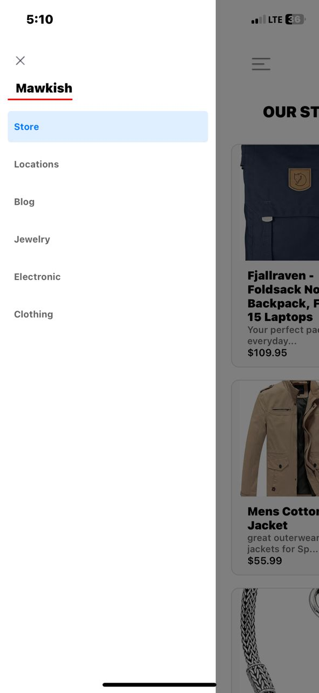
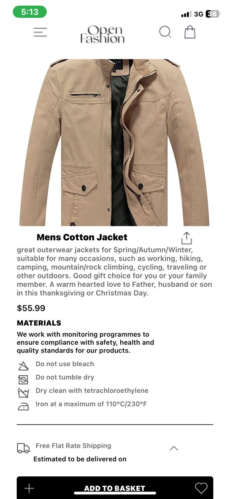
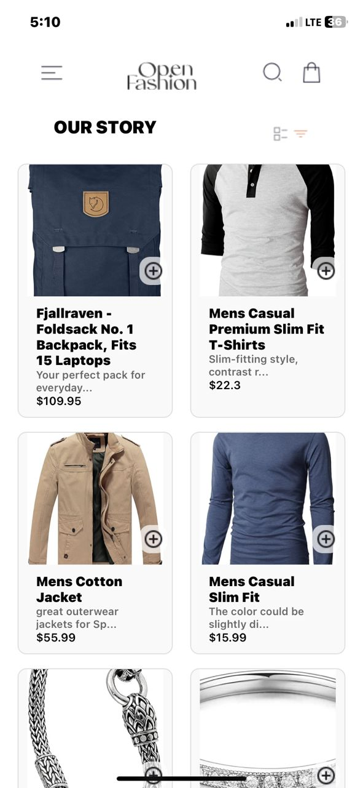
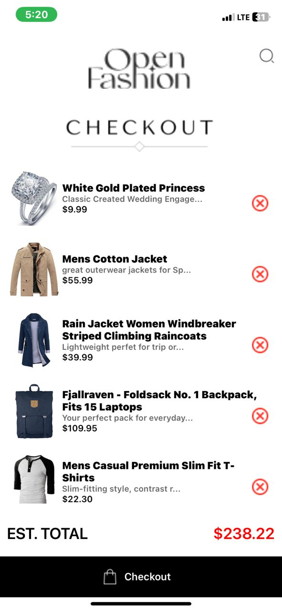

# Assignment7 
# 11300128
# Shopping Cart Application
 This is a shopping cart application created with React and JavaScript. Users may see available goods, add them to their carts, delete them, and read item information.

  # Features
 The application is designed to have three distinct Screens with a drawer to ensure easy navigation. These are 
 - Home Screen
 - Product Details Screen
 - Cart Screen
 - Drawer Navigation
 ### Home Screen: 
 View a list of products.
 ### Product Details: 
 View product details in a modal.
 ### Cart Screen: 
 View and manage cart items, see the total price.
 ### Drawer Navigation:
 Navigate between different sections of the app.
# State Management
useState: Manages local state (cart items, products, loading status).
useEffect: Fetches data and performs side effects.
  
# Data Storage
AsyncStorage: Saves cart items between sessions.

 # Navigation
React Navigation: It incorporates stack and drawer navigation.

# Components
Home Screen (HomeScreen.js)
Fetches products from https://fakestoreapi.com/products using axios.
FlatList displays products in a grid.
Displays product details in a modal.
Adds items to the cart.
Cart Screen (CartScreen.js) retrieves cart items from Async Storage.
Shows cart items and total price.
Allows you to remove things from the cart.
The ProductItem.js component displays product images, titles, descriptions, and prices.
Adds items to the cart.
App Component (App.js) enables navigation using DrawerNavigator and StackNavigator.

# Screenshots
 
 
 
 

